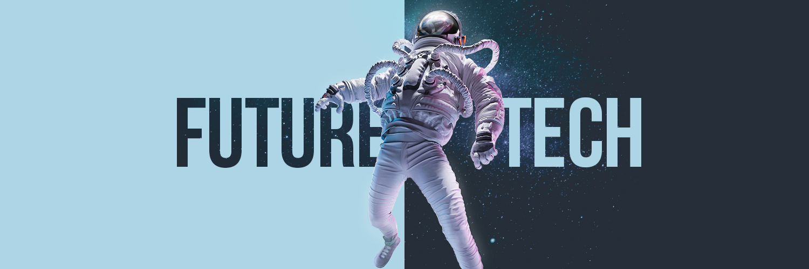

<h1 align="center">Hi there 👋, I'm Vinicius Medeiros</h1>
<h3 align="center">Enthusiast of the best web & mobile development technologies.</h3>

   

I’m a full stack developer that loves everything about coding.

> "Nothing in this world beats good old persistence. Talent does not surpass. Nothing more common than talented failures. Genius does not overcome. Unrecognized geniuses is practically a cliche. Education does not exceed. The world is full of educated fools. Persistence and determination alone are powerful."

### ✨ Seeking knowledge all the time  
My learning is based on creating projects and contributing to the open source community. 

### 💡 Driven by shipping products that help people  
My passion for programming is related to create incredible things and help people, doesn't matter the technology stack.

### ☕️ Wanna chat? 
In my free time I like to play (and watch) soccer ⚽️, to watch movies 🎞️ and series 📺, to read books 📚, to listen to music 🎵 and eventually I like to philosophize about life with a beer 🍺.

 
 
